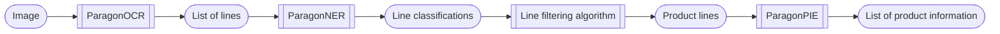

# ParagonPIE (formerly ParagonNLP2)

## What is it?
ParagonPIE (ProductInformationExtraction) is a transformer based neural network designed to extract product information from lines of polish receipts.

---

## Purpose
This project is self-sufficient, although it builds up on previous two [ParagonOCR](https://github.com/princepsnoctis/paragonOCR) and [ParagonNER](https://github.com/princepsnoctis/paragonNLP) (formerly ParagonNLP).

The intended pipeline is:

